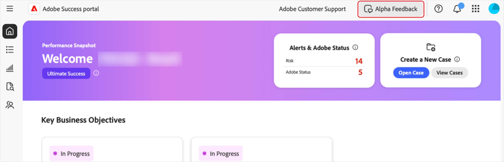

# Zugriff auf das [!DNL Adobe Success]-Portal

In dieser Anleitung wird erklärt, wie Sie sich beim [!DNL Adobe Success]-Portal anmelden und Unterstützung erhalten, wenn Zugriffsprobleme auftreten.

Sie erhalten eine Benachrichtigung vom **[!UICONTROL Success]**-Portal-Team, die Ihren Zugriff bestätigt. Diese Nachricht enthält die Anmeldedaten.

1. Navigieren Sie zu [https://experience.adobe.com/](https://experience.adobe.com/).
1. Melden Sie sich mit Ihrer Adobe ID an.
1. Wählen Sie das Symbol **[!UICONTROL Success-Portal (Alpha)]** aus.

   ")

1. Nach der Anmeldung werden fünf Registerkarten angezeigt:

   

   * Startseite
   * **[!UICONTROL Aktionsplan]**
   * **[!UICONTROL Value Tracker]**
   * **[!UICONTROL Support und Erkenntnisse]**
   * **[!UICONTROL Support-Interaktionsplan]**

## Fehlerbehebung und Support

Wenn beim Zugriff auf das Portal oder seine Funktionen Probleme auftreten, wenden Sie sich über den [Alpha-Teams-Kanal](https://teams.microsoft.com/l/channel/19:h-GcuAZs9uF05rervqTdx2U27ohYINuRUIfbMte9B-U1@thread.tacv2/General?groupId=02b87789-3475-47e4-94c1-0981f63ae89f&tenantId=fa7b1b5a-7b34-4387-94ae-d2c178decee1) an unser Team.   

Sie können die Schaltfläche **[!UICONTROL Alpha-Feedback]** im Portal verwenden, um Feedback zu senden.

>[!NOTE]
>
>Das Feedback-Tool ist kein spezieller Support-Kanal. Es ist nicht für dringende Anmeldeprobleme geeignet.

