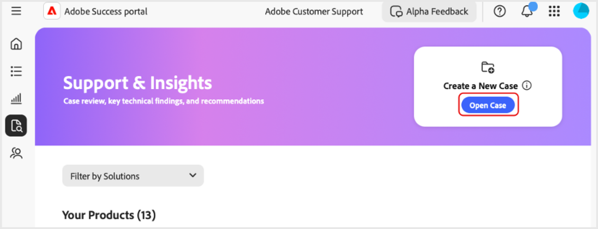

# Erstellen und Verwalten von Fällen im [!DNL Adobe Success] Portal

In diesem Handbuch wird erläutert, wie Sie Berichte für Fälle im [!DNL Adobe Success] Portal erstellen, anzeigen und herunterladen.

## Fall öffnen

Sie können einen Fall über die Registerkarte Startseite oder die Registerkarte **[!UICONTROL Support und Einblicke]** öffnen.

So greifen Sie über **[!UICONTROL Registerkarte „Startseite]** auf die Seite „Fall öffnen“ zu:

1. Navigieren Sie zur Registerkarte Startseite .
1. Wählen Sie **[!UICONTROL Fall öffnen]**.

   

1. Füllen Sie die erforderlichen Felder aus:
   1. **[!UICONTROL Produkt auswählen]**.
   1. **[!UICONTROL Anwaltsbezeichnung]**.
   1. **[!UICONTROL Fallbeschreibung]**.
1. Wählen Sie **[!UICONTROL Fall senden]** aus.

   

So greifen Sie über die Registerkarte **[!UICONTROL Support und Einblicke]** auf die Seite **[!UICONTROL Offener Fall]** zu.

1. Navigieren Sie zur Registerkarte **[!UICONTROL Support und]**&quot;.
1. Wählen Sie **[!UICONTROL Fall öffnen]**.

   

Gehen Sie wie oben beschrieben vor, um den Vorgang abzuschließen und zu übermitteln.

## Fall anzeigen

Sie können einen Fall auf der Startseite oder auf der Registerkarte **[!UICONTROL Support und Einblicke]** anzeigen.

So greifen Sie über **[!UICONTROL Registerkarte „Startseite]** auf die Seite „Fälle anzeigen“ zu:

1. Navigieren Sie zur Registerkarte Startseite .
1. Wählen Sie **[!UICONTROL Fälle anzeigen]** aus.

   

1. Wählen Sie die Produktkarte aus, die Sie anzeigen möchten, und wählen Sie dann **[!UICONTROL Offene Fälle]** oder **[!UICONTROL Geschlossene Fälle]**.

   >[!NOTE]
   >
   >Sie können auch die Registerkarte **[!UICONTROL Support und Einblicke]** auswählen, um schnell auf Produktkarten mit Links **[!UICONTROL Offene]** oder **[!UICONTROL Geschlossene]**&quot; zuzugreifen.

   

1. Klicken Sie auf **[!UICONTROL Fallnummer]**, um die Falldetails anzuzeigen.

   

## Fallberichte herunterladen

Herunterladen von PDF-Berichten zu Ihren Fällen:

1. Navigieren Sie zur Registerkarte Startseite .
1. Wählen Sie **[!UICONTROL Fälle anzeigen]** aus.

   

1. Wählen Sie die Produktkarte aus, die Sie anzeigen möchten, und wählen Sie dann **[!UICONTROL Offene Fälle]** oder **[!UICONTROL Geschlossene Fälle]**.

   >[!NOTE]
   >
   >Sie können auch die Registerkarte **[!UICONTROL Support und Einblicke]** auswählen, um schnell auf Produktkarten mit Links zu **[!UICONTROL Offene]** oder **[!UICONTROL Geschlossene Fälle]** zuzugreifen.

   

1. Aktivieren Sie auf [ Seite „Produkt] - Support-Fälle“ das Kontrollkästchen neben dem Fall, den Sie herunterladen möchten, und wählen Sie **[!UICONTROL Fall herunterladen]** aus.

   
