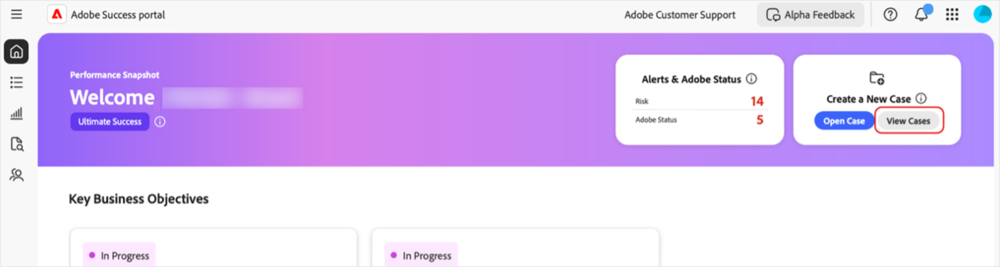
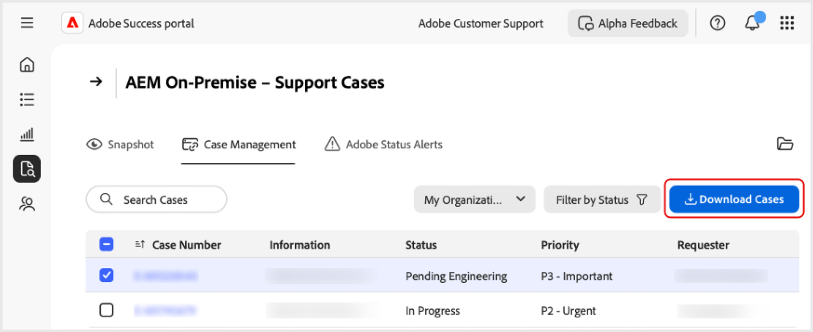

# Erstellen und Verwalten von Fällen im [!DNL Adobe Success]-Portal

In dieser Anleitung wird erläutert, wie Sie im [!DNL Adobe Success]-Portal Berichte für Fälle erstellen, anzeigen und herunterladen.

## Eröffnen eines Falls

Sie können einen Fall über die Registerkarte „Startseite“ oder die Registerkarte **[!UICONTROL Support und Erkenntnisse]** öffnen.

So greifen Sie über die Registerkarte „Startseite“ auf die Seite **[!UICONTROL Fall öffnen]** zu:

1. Navigieren Sie zur Registerkarte „Startseite“.
1. Wählen Sie **[!UICONTROL Fall öffnen]** aus.

   

1. Füllen Sie die erforderlichen Felder aus:
   1. **[!UICONTROL Produkt auswählen]**.
   1. **[!UICONTROL Titel des Falls]**.
   1. **[!UICONTROL Beschreibung des Falls]**.
1. Wählen Sie **[!UICONTROL Fall senden]** aus.

   

So greifen Sie über die Registerkarte **[!UICONTROL Support und Erkenntnisse]** auf die Seite **[!UICONTROL Fall öffnen]** zu.

1. Navigieren Sie zur Registerkarte **[!UICONTROL Support und Erkenntnisse]**.
1. Wählen Sie **[!UICONTROL Fall öffnen]** aus.

   

Führen Sie dieselben Schritte wie oben durch, um den Vorgang abzuschließen und zu übermitteln.

## Anzeigen eines Falls

Sie können einen Fall auf der Registerkarte „Startseite“ oder auf der Registerkarte **[!UICONTROL Support und Erkenntnisse]** anzeigen.

So greifen Sie über die Registerkarte „Startseite“ auf die Seite **[!UICONTROL Fälle anzeigen]** zu:

1. Navigieren Sie zur Registerkarte „Startseite“.
1. Wählen Sie **[!UICONTROL Fälle anzeigen]** aus.

   

1. Wählen Sie die Produktkarte aus, die Sie anzeigen möchten, und wählen Sie dann **[!UICONTROL Offene Fälle]** oder **[!UICONTROL Geschlossene Fälle]** aus.

   >[!NOTE]
   >
   >Sie können auch die Registerkarte **[!UICONTROL Support und Erkenntnisse]** auswählen, um mit den Links **[!UICONTROL Offene Fälle]** oder **[!UICONTROL Geschlossene Fälle]** schnell auf Produktkarten zuzugreifen.

   

1. Klicken Sie auf **[!UICONTROL Fallnummer]**, um die Falldetails anzuzeigen.

   

## Herunterladen von Fallberichten

So laden Sie PDF-Berichte zu Ihren Fällen herunter:

1. Navigieren Sie zur Registerkarte „Startseite“.
1. Wählen Sie **[!UICONTROL Fälle anzeigen]** aus.

   

1. Wählen Sie die Produktkarte aus, die Sie anzeigen möchten, und wählen Sie dann **[!UICONTROL Offene Fälle]** oder **[!UICONTROL Geschlossene Fälle]**.

   >[!NOTE]
   >
   >Sie können auch die Registerkarte **[!UICONTROL Support und Erkenntnisse]** auswählen, um mit den Links **[!UICONTROL Offene Fälle]** oder **[!UICONTROL Geschlossene Fälle]** schnell auf Produktkarten zuzugreifen.

   

1. Aktivieren Sie auf der Seite [Produkt – Support-Fälle] das Kontrollkästchen neben dem Fall, den Sie herunterladen möchten, und wählen Sie **[!UICONTROL Fälle herunterladen]** aus.

   
