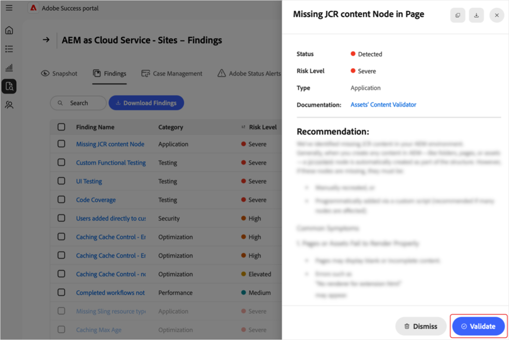

# Verwalten der Feststellungen im [!DNL Adobe Success]-Portal

In dieser Anleitung wird erläutert, wie Sie im[!DNL Adobe Success]-Portal auf die Feststellungen zugreifen, sie interpretieren und darauf reagieren können, um Produktleistung, Sicherheit und Funktionsrisiken proaktiv zu verwalten.

Auf der Seite **[!UICONTROL Feststellungen]** des [!DNL Adobe Success]-Portals werden die in Ihrer Adobe-Produktinstanz erkannten Probleme oder Risiken angezeigt. Die Feststellungen umfassen Leistungs-, Sicherheits- und Funktionsprobleme sowie deren Status und Risikostufe. Wenn Sie diese Seite überwachen, können Sie Probleme frühzeitig beheben, bevor sie sich auf Ihre Umgebungen auswirken.

**Was sind Feststellungen?**

Feststellungen sind Warnhinweise mit Support-Erkenntnissen, die im [!DNL Adobe Success]-Portal angezeigt werden. Sie zeigen potenzielle Probleme in Ihrem Adobe-Produkt-Setup auf, z. B. Leistungseinbußen, Sicherheitsrisiken oder falsche Konfigurationen. Diese Warnhinweise basieren auf Telemetriedaten, die von Tools wie APIs, [!DNL New Relic] und [!DNL Splunk] erfasst werden.

**Wie werden Feststellungen ermittelt?**

Adobe-Teams untersuchen regelmäßig die häufigsten Support-Probleme und die Trends. Basierend auf den Erkenntnissen fügen sie dem System neue Prüfungen hinzu. Einmal täglich scannt das [!DNL Adobe Success]-Portal Produktdaten, um Probleme zu erkennen, z. B. Fehlkonfigurationen, hängengebliebene Aufträge oder alles, was zu einem Systemausfall führen könnte. Wenn eine Prüfung etwas außerhalb des sicheren Bereichs findet (wie von den Produkt- und Supportteams von Adobe definiert), wird das als Feststellung angezeigt.

**Warum sind Feststellungen wichtig**

Die regelmäßige Überprüfung der Feststellungen hilft, Probleme frühzeitig zu erkennen – bevor sie sich auf Ihr System oder Ihre Kunden und Kundinnen auswirken. Dieser proaktive Ansatz verbessert die Systemstabilität, reduziert Ausfallzeiten und unterstützt Best Practices.

**So beheben Sie Feststellungen**

Zu jeder Feststellung gehören Empfehlungen und klare Anweisungen zur Lösung des Problems sowie Links zu relevanter Dokumentation, sofern verfügbar. Geben Sie diese Feststellungen an Ihre IT-Abteilung, Ihr Engineering-Team oder Ihren Adobe-Partner weiter und arbeiten Sie gemeinsam an der Problembehebung. Die frühzeitige Lösung dieser Probleme hilft, größere Probleme zu vermeiden, und sorgt dafür, dass Ihr System reibungslos läuft.

## Zugreifen auf Feststellungen

So zeigen Sie Erkenntnisse zu einem Produkt an:

1. Navigieren Sie zu **[!UICONTROL Support und Erkenntnisse]**.
1. Wählen Sie die entsprechende Produktkarte aus. Wählen Sie die Registerkarte **[!UICONTROL Feststellungen]** aus.

   

1. Es wird eine Liste aller Feststellungen für das ausgewählte Produkt angezeigt.

   

1. Hier sind die folgenden Aktionen möglich:

   

   * Suchen Sie nach bestimmten Einträgen.
   * Exportieren Sie die Liste der Feststellungen, indem Sie **[!UICONTROL Feststellungen herunterladen]** auswählen. Um einen Bericht für eine einzelne Feststellung zu exportieren, aktivieren Sie das Kontrollkästchen neben der entsprechenden Feststellung in der Spalte **[!UICONTROL Name der Feststellung]**. Wenn Sie keine Feststellung auswählen, enthält die PDF-Datei standardmäßig eine Liste aller Feststellungen.
   * Zeigen Sie Details zu einer Feststellung an, einschließlich einer empfohlenen Lösung, indem Sie unter **[!UICONTROL Name der Feststellung]** eine Feststellung auswählen. Auf der Detailseite zur Feststellung wird die ausgewählte Feststellung mit zusätzlichem Kontext und einer Empfehlung angezeigt. Um diesen Bericht anzuzeigen, klicken Sie auf den Dowlnoad-Pfeil.

     

## Aktionsfeststellungen

Führen Sie diese Schritte aus, um zu überprüfen, ob die einzelnen Feststellungen weiterhin gelten oder verworfen werden können.

>[!NOTE]
>
>Standardprüfungen werden auf Ihren Instanzen ausgeführt. Wenn bei den Prüfungen nicht festgestellt wird, dass das Problem auf Ihrer Instanz vorliegt, wird der Status **[!UICONTROL Nicht erkannt]** angezeigt.

1. Navigieren Sie zu **[!UICONTROL Support und Erkenntnisse]**.
1. Wählen Sie die entsprechende Produktkarte aus.
1. Öffnen Sie die Registerkarte **[!UICONTROL Feststellungen]**. Sie sehen alle Feststellungen für das ausgewählte Produkt.
1. Wählen Sie einen Eintrag unter **[!UICONTROL Name der Feststellung]** aus. Auf der Seite mit den Feststellungsdetails haben Sie folgende Möglichkeiten:
   * Wählen Sie **[!UICONTROL Validieren]** aus, um zu überprüfen, ob das Problem noch vorhanden ist (die Schaltfläche **[!UICONTROL Validieren]** dient zur Bestätigung, dass das Problem behoben wurde):

   

   * Wenn das Problem weiterhin besteht, wird die folgende Meldung angezeigt: *[!UICONTROL Die Überprüfung ist abgeschlossen. Feststellungen wird noch erkannt]*. Verwenden Sie die Informationen und Empfehlungen auf der Seite mit den Feststellungsdetails, um das Problem zu untersuchen und zu beheben.
   * Wenn das Problem nicht mehr vorhanden ist, wird die folgende Meldung angezeigt: *[!UICONTROL Die Überprüfung ist abgeschlossen. Die Feststellung wurde nicht mehr erkannt]*. Wenn die Feststellung nicht mehr erkannt wird, wird sie ausgegraut und ihr Status ändert sich in **[!UICONTROL Nicht erkannt]**. Feststellungen mit dem Status **[!UICONTROL Nicht erkannt]** befinden sich ganz unten in der Liste der Feststellungen.
   * Wenn das Problem für Sie nicht zutreffend oder relevant ist, können Sie es durch Auswahl von **[!UICONTROL Verwerfen]** schließen. Wenn die Feststellung verworfen wird, wird sie ausgegraut und ihr Status ändert sich in **[!UICONTROL Verworfen]**.  Feststellungen mit dem Status **[!UICONTROL Verworfen]** befinden sich ganz unten in der Liste der Feststellungen.

## Verstehen der Feststellungen

* **[!UICONTROL Name der Feststellung]** Wählen Sie diese Option aus, um detaillierte Erkenntnisse und empfohlene Lösungsschritte zu erhalten.
* **[!UICONTROL Typ]**: kategorisiert als *Funktionalität*, *Leistung* und *Sicherheit*.
* **[!UICONTROL Risikostufe]**: Schweregrad-Indikator mit visuellen Indikatoren.
* **[!UICONTROL Status]**: der aktuelle Status der Feststellung (z. B. *Erkannt*, *Nicht erkannt*, *Verworfen*).
* **[!UICONTROL Letzte Ausführung der Prüfung]**: Zeitstempel der letzten Prüfung, die die Feststellung aktualisiert hat.

## Best Practices

Auf der Seite **[!UICONTROL Feststellungen]** werden Empfehlungen zusammen mit den folgenden Risikostufen angezeigt: **[!UICONTROL Hoch]**, **[!UICONTROL Erhöht]** und **[!UICONTROL Mittel]**. **[!UICONTROL Hoch]** ist kritisch, **[!UICONTROL Erhöht]** ist dringend und **[!UICONTROL Mittel]** ist nicht kritisch. So erhalten Sie den Zustand und die Leistung der Site:

* Beheben Sie Feststellungen mit der Risikostufe **[!UICONTROL Hoch]** umgehend, da sie kritische Bedrohungen darstellen.
* Beheben Sie Probleme mit der Risikostufe **[!UICONTROL Erhöht]** zeitnah, um eine Eskalation zu vermeiden.
* Überwachen Sie Feststellungen mit der Risikostufe **[!UICONTROL Mittel]** regelmäßig und handeln Sie bei Bedarf.
