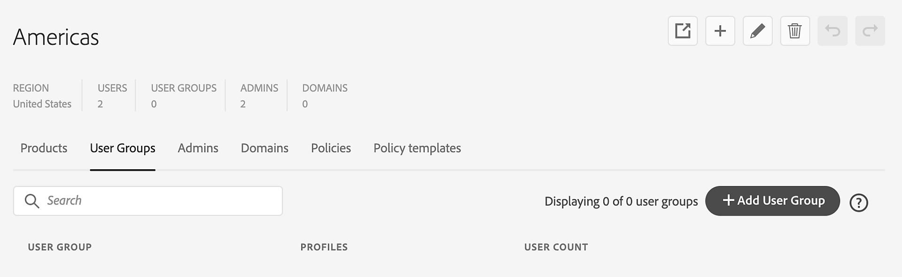

# Verwalten von Benutzergruppen in der Global Admin Console

Erstellen, verwalten und teilen Sie Benutzergruppen in der Global Admin Console, um die Benutzerverwaltung zu optimieren, indem Sie Benutzende mit denselben Berechtigungen gruppieren, Zeit sparen und Konsistenz sicherstellen.

Wählen Sie in der {0[Global Admin Console} eine Organisation aus und navigieren Sie zu &#x200B;](https://experienceleague.adobe.com/de/docs/support-resources/adobe-support-tools-guide/adobe-admin-console/adopt-global-administration)Benutzergruppen **[!UICONTROL .]** Geben Sie Gruppen über mehrere Organisationen hinweg mithilfe einer einzigen Benutzerverwaltungsquelle frei, um Benutzer und Gruppen zu synchronisieren. Klicken Sie hier [melden Sie sich bei der Global Admin Console an](https://global-admin-console.adobe.com).

## Erstellen von Benutzergruppen

Sie können [Benutzergruppen](https://helpx.adobe.com/de/enterprise/using/user-groups.html) einzeln, in großen Mengen oder [direkt synchronisieren) aus einer etablierten Azure-Anzeige &#x200B;](https://helpx.adobe.com/de/enterprise/using/add-azure-sync.html) einem Federated Directory in der Adobe Admin Console erstellen. In der Global Admin Console können Sie Benutzergruppen mit entsprechenden Produktprofilen definieren, denen die Benutzergruppen-Administrierenden später mithilfe der Admin Console Benutzende hinzufügen können.

1. Melden Sie sich bei der [Global Admin Console](https://global-admin-console.adobe.com/) an, wählen Sie eine zu bearbeitende Organisation aus und navigieren Sie dann zur Registerkarte **[!UICONTROL Benutzergruppen]** .

2. Wählen **[!UICONTROL Benutzergruppe hinzufügen]** aus.

   

   _Fügen Sie einer Organisation Benutzergruppen hinzu, um die Benutzerverwaltung zu optimieren._

3. Geben Sie im Dialogfeld **[!UICONTROL Benutzergruppe hinzufügen]** Folgendes ein:
   - **[!UICONTROL Name]**: Geben Sie einen Namen für die Benutzergruppe an.
   - **[!UICONTROL Produktprofile]**: Wenn Sie den aktuellen oder künftigen Mitgliedern in der Benutzergruppe Produktzugriff gewähren möchten, klicken Sie auf den Dropdown-Pfeil, um ein Produktprofil aus der Liste auszuwählen, oder geben Sie den Produktprofilnamen ein und wählen Sie ihn aus der angezeigten Dropdown-Liste aus. Wenn Sie ein Produktprofil hinzufügen möchten, das noch nicht erstellt wurde, müssen Sie dies zunächst über die Registerkarte [Produktprofile](https://helpx.adobe.com/de/enterprise/using/global-admin-edit-organizations.html#profiles) tun.
   - **[!UICONTROL Administratoren]**: Klicken Sie auf den Dropdown-Pfeil, um einen Administrator aus der Liste auszuwählen, oder geben Sie die E-Mail-Adresse des Administrators ein und wählen Sie sie aus der angezeigten Dropdown-Liste aus. Wenn Sie einen neuen Administrator hinzufügen möchten, der noch nicht erstellt wurde, müssen Sie diesen Administrator zuerst auf der Registerkarte [Administratoren](#share-user-groups) erstellen.

   Die von Ihnen angegebenen Produktprofile werden der Benutzergruppe zugewiesen und die von Ihnen angegebenen Administratoren werden zu Benutzergruppenadministratoren für die Gruppe. Die Benutzergruppen-Administratoren bzw. -Administratorinnen können die Adobe Admin Console für das jeweilige Unternehmen verwenden, um die Gruppe zu verwalten.

4. Wählen Sie **[!UICONTROL Speichern]** aus.

5. Wählen **[!UICONTROL Ausstehende Änderungen überprüfen]**, um die Aktualisierungen zu überprüfen. Wählen Sie dann **[!UICONTROL Änderungen übermitteln]** aus, um [&#x200B; auszuführen](https://experienceleague.adobe.com/de/docs/support-resources/adobe-support-tools-guide/adobe-admin-console/set-up-organizations).

   >[!NOTE]
   >
   >Globale Administrierende können [&#x200B; Benutzergruppen mithilfe der Global Admin Console &#x200B;](#review-user-groups) Produktprofile und Benutzergruppen-Administrierende zuweisen. Mithilfe der Adobe Admin Console können System- und Benutzergruppenadministrierende der Benutzergruppe [Benutzende hinzufügen und &#x200B;](https://helpx.adobe.com/de/enterprise/using/user-groups.html) und Produktprofile zuweisen“.

## Freigeben von Benutzergruppen

Mit der Gruppenprojektion können Sie Benutzergruppen und die mit ihnen verknüpften Benutzer von einer einzigen Verwaltungsquelle mit mehreren Admin Consoles synchronisieren. Globale Administratoren können Benutzergruppen für hierarchische untergeordnete Elemente der Quellorganisation freigeben, wobei die Arbeit nach unten erfolgt und nicht von oben nach unten oder nebeneinander.

1. Melden Sie sich bei der [Global Admin Console](https://global-admin-console.adobe.com/) an, wählen Sie ein Unternehmen aus und navigieren Sie zur Registerkarte **[!UICONTROL Benutzergruppen]**.

2. Aktivieren Sie die Kontrollkästchen für die Benutzergruppen, die Sie freigeben möchten.

   Gruppen können in den folgenden Fällen für die Freigabe deaktiviert werden:
   - Die Benutzergruppe wird von einer anderen Organisation freigegeben. Um die Gruppe freizugeben oder zu bearbeiten, wählen Sie in der Organisationshierarchie die Organisation aus, der sie gehört.
   - Das Unternehmen verwendet keinen [Adobe-Speicher für Unternehmen](https://helpx.adobe.com/in/enterprise/using/storage-for-business.html) der schrittweise global bereitgestellt wird.
   - Die Organisationsrichtlinie ist deaktiviert. Gehen Sie zur Registerkarte **[!UICONTROL Richtlinien]**, um die Richtlinie **[!UICONTROL Freigegebene Benutzergruppen verwalten]** zu aktivieren.
   - Die Organisation verfügt über keine untergeordneten Organisationen, für die Benutzergruppen freigegeben werden können.

3. Wählen Sie **[!UICONTROL Benutzergruppe freigeben]** aus.

4. Überprüfen Sie die Benutzergruppen, um sie für andere Organisationen freizugeben. Wenn Sie in der ausgewählten Organisation auch Systemadministrator sind, wählen Sie die Option **[!UICONTROL In Admin Console öffnen]**  Symbol, um die Liste der Benutzergruppenmitglieder in der Adobe Admin Console zu überprüfen.

   >[!NOTE]
   >
   >Um Konflikte zu vermeiden, stellen Sie sicher, dass die Organisationen, für die Sie Benutzergruppen freigeben möchten, noch keine Gruppen mit demselben Namen haben.

5. Klicken Sie auf **[!UICONTROL Weiter]**.

6. Wählen Sie die Organisationen aus, für die Sie Benutzergruppen freigeben möchten, und wählen Sie **[!UICONTROL Weiter]**.

7. Wenn keine Konflikte vorliegen, wählen Sie **[!UICONTROL Benutzergruppen freigeben]** aus.

   Wenn es Konflikte gibt (bei denen in der Zielorganisation Benutzergruppen mit demselben Namen vorhanden sind), wählen Sie eine der folgenden Optionen und dann **[!UICONTROL Benutzergruppen freigeben]**:
   - **[!UICONTROL Ignorieren (Standard)]**: Überspringen Sie die Gruppen in den Zielorganisationen mit demselben Namen.
   - **[!UICONTROL Nur hinzufügen]**: Führen Sie die Benutzergruppen zusammen, indem Sie neue Benutzer zu den vorhandenen Benutzergruppen hinzufügen, ohne Benutzer zu entfernen.
   - **[!UICONTROL Mirrorgruppe]**: Passen Sie die Gruppen der Zielorganisation an die freigegebene Gruppe an, indem Sie Benutzer hinzufügen oder entfernen.

8. Wählen **[!UICONTROL Ausstehende Änderungen überprüfen]**, um die Aktualisierungen zu überprüfen. Wählen Sie dann **[!UICONTROL Änderungen übermitteln]** aus, um [&#x200B; auszuführen](https://experienceleague.adobe.com/de/docs/support-resources/adobe-support-tools-guide/adobe-admin-console/set-up-organizations).

   Gruppenprojektionsereignisse werden zu Ihrer Referenz protokolliert. Erfahren Sie [Anzeigen und Herunterladen von Auditprotokollen](https://experienceleague.adobe.com/de/docs/support-resources/adobe-support-tools-guide/adobe-admin-console/download-audit-logs-and-export-reports).

Wenn Sie eine Benutzergruppe freigeben, werden die Gruppe und ihre Benutzer der Zielorganisation hinzugefügt. Die *Quellbenutzergruppe“ steuert jedoch* freigegebenen Benutzergruppen und deren Benutzer. Die Administrator- und Produktprofilzuweisungen werden *nicht* zwischen den Organisationen synchronisiert.

Änderungen am Namen der geplanten Benutzergruppe oder an zugehörigen Benutzern in der Quellbenutzergruppe werden in der Zielorganisation automatisch aktualisiert. Die freigegebene Benutzergruppe kann zwar nicht direkt verwaltet werden, aber ein Administrator innerhalb der Zielorganisation kann Produktprofile einer freigegebenen Gruppe zuweisen und so den Benutzenden der Gruppe Lizenzzugriff gewähren.

## Widerrufen des Zugriffs auf freigegebene Gruppen

1. Melden Sie sich bei der [Global Admin Console](https://global-admin-console.adobe.com/) an, wählen Sie ein Unternehmen aus und navigieren Sie zur Registerkarte **[!UICONTROL Benutzergruppen]**.

2. Wählen Sie **[!UICONTROL Freigegebenen Zugriff verwalten]** für die entsprechende Benutzergruppe aus.

3. Wählen Sie die Organisationen aus, deren Zugriff Sie sperren möchten.

4. Wählen Sie **[!UICONTROL Zugriff widerrufen]** aus.

5. Beim Widerrufen des Zugriffs können Sie entweder die Benutzergruppe und die Benutzer löschen oder eine Kopie in den Zielorganisationen lassen:
   - Beim Löschen wird die Benutzergruppe aus den Zielorganisationen entfernt. Benutzer, die nicht Mitglieder anderer freigegebener Gruppen sind, werden aus den Zielorganisationen entfernt und verlieren den Zugriff auf alle Produkte, Services und Assets.
   - Beim Hinterlassen einer Kopie bleiben Benutzergruppe und Benutzer in den Zielorganisationen, wobei alle Zuweisungen intakt bleiben. Die Benutzergruppe wird jedoch nicht mehr synchronisiert und kann von den Administratoren der Zielorganisationen verwaltet werden.

6. Wählen Sie **[!UICONTROL Zugriff widerrufen]** aus.

7. Wählen **[!UICONTROL Ausstehende Änderungen überprüfen]**, um die Aktualisierungen zu überprüfen. Wählen Sie dann **[!UICONTROL Änderungen übermitteln]** aus, um [&#x200B; auszuführen](https://experienceleague.adobe.com/de/docs/support-resources/adobe-support-tools-guide/adobe-admin-console/set-up-organizations).

## Benutzergruppen bearbeiten

1. Melden Sie sich bei der [Global Admin Console](https://global-admin-console.adobe.com/) an, wählen Sie ein Unternehmen aus und navigieren Sie zur Registerkarte **[!UICONTROL Benutzergruppen]**.

2. Wählen Sie die **[!UICONTROL Weitere Optionen]**  das Symbol für die entsprechende Benutzergruppe an und wählen Sie **[!UICONTROL Benutzergruppe bearbeiten]**.

   >[!NOTE]
   >
   >Sie können keine Benutzergruppen bearbeiten, deren Inhaber die ausgewählte Organisation nicht ist.

   

   _Bearbeiten Sie die Benutzergruppen, um den Namen der Benutzergruppe, die Produktprofile oder die Admins zu aktualisieren._

3. Aktualisieren Sie den Namen der Benutzergruppe, Produktprofile oder Administratoren. Wählen Sie dann **[!UICONTROL Speichern]** aus.

   >[!NOTE]
   >
   >Im **[!UICONTROL Benutzergruppe bearbeiten]** können Sie Administratorrollen nur Benutzern zuweisen, denen in dieser Organisation bereits eine Administratorrolle zugewiesen wurde. Erfahren Sie, wie [neue Administratoren hinzufügen](https://experienceleague.adobe.com/de/docs/support-resources/adobe-support-tools-guide/adobe-admin-console/manage-administrators).

4. Wählen **[!UICONTROL Ausstehende Änderungen überprüfen]**, um die Aktualisierungen zu überprüfen. Wählen Sie dann **[!UICONTROL Änderungen übermitteln]** aus, um [&#x200B; auszuführen](https://experienceleague.adobe.com/de/docs/support-resources/adobe-support-tools-guide/adobe-admin-console/set-up-organizations).

   >[!NOTE]
   >
   >Wenn Sie den Namen einer freigegebenen Benutzergruppe ändern, werden die Änderungen in der Zielorganisation automatisch aktualisiert.

## Benutzergruppen löschen

1. Melden Sie sich bei der [Global Admin Console](https://global-admin-console.adobe.com/) an, wählen Sie ein Unternehmen aus und navigieren Sie zur Registerkarte **[!UICONTROL Benutzergruppen]**.

2. Wählen Sie die **[!UICONTROL Weitere Optionen]**  das Symbol für die entsprechende Benutzergruppe an und wählen Sie **[!UICONTROL Benutzergruppe löschen]**.

   >[!NOTE]
   >
   >Sie können keine Benutzergruppen löschen, deren Inhaber die ausgewählte Organisation nicht ist.

3. Wählen **[!UICONTROL in]** angezeigten Dialogfeld „OK“ aus.

   >[!CAUTION]
   >
   >Das Löschen einer Benutzergruppe kann sich auf die Benutzenden auswirken. Stellen Sie sicher, dass beim Löschen der Benutzergruppe keine Zugriffsrechte oder Informationen verloren gehen.

4. Nachdem Sie die Organisationen bearbeitet haben, wählen Sie **[!UICONTROL Ausstehende Änderungen überprüfen]** aus, um sie zu überprüfen. Wählen Sie dann **[!UICONTROL Änderungen übermitteln]** aus, um [&#x200B; auszuführen](https://experienceleague.adobe.com/de/docs/support-resources/adobe-support-tools-guide/adobe-admin-console/set-up-organizations).
