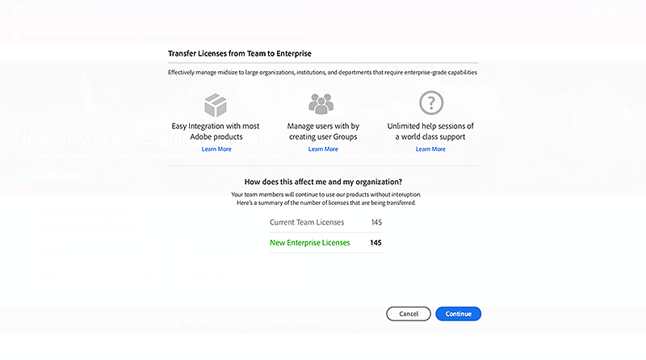
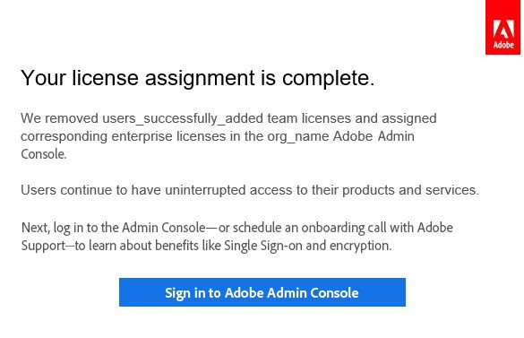

# Migrieren vorhandener Benutzer zur Adobe Admin Console

Gilt für Unternehmen und Teams.

Dieses Dokument richtet sich an Unternehmen mit bestehenden Creative Cloud-, Document Cloud- und Acrobat-Lizenzen im Rahmen eines Enterprise Term License Agreement (ETLA)- oder Value Incentive Plan (VIP)-Abonnements, die zu einem anderen Kaufprogramm oder Lizenztyp migrieren.

>[!NOTE]
>
>Wenn Sie in Nordamerika sind und Hilfe bei der jährlichen Verlängerung Ihres Adobe VIP-Vertrags von Ihrem Account Manager benötigen, senden Sie eine E-Mail an **renewalhelp@adobe.com**. Wir werden uns in Kürze mit Ihnen in Verbindung setzen.

Um eine Unterbrechung des Produktzugriffs für Endbenutzer zu vermeiden, müssen Sie Lizenzen in der Adobe Admin Console zuweisen, bevor die bestehende VIP-Abonnementlaufzeit endet.

* Kunden von ETLA sollten eine Produktüberschneidung von mindestens 30 Tagen einräumen. Schließen Sie die Migration vor dem Jubiläumsdatum ab, damit Benutzer weiterhin Zugriff auf Adobe-Apps und -Services haben. Weitere Informationen zum Ablauf von ETLA-Verträgen finden Sie [Automatisierte Ablaufphasen für ETLA-Verträge](https://helpx.adobe.com/enterprise/using/contract-expiry.html).
* Kaufen Sie für VIP-Kunden Lizenzen vor dem Jubiläumsdatum, und weisen Sie Lizenzen zu, bevor das Verlängerungsfenster zu Ihrer aktuellen VIP-Laufzeit geschlossen wird.
* CLP- oder TLP-Kunden können mithilfe der Migrationsanweisungen unter „Lizenzierung“ von serialisierten Acrobat- oder Creative Suite-[ zu ](https://helpx.adobe.com/enterprise/using/licensing.html) migrieren.

>[!NOTE]
>
>Wenn sich der Lizenztyp Ihres Unternehmens ändert, müssen sich Endbenutzer von allen Adobe-Produkten oder -Services abmelden und sich mit denselben Anmeldeinformationen wieder anmelden.
>
>Verwenden Sie für Desktop-Produkte wie Photoshop, Acrobat und Illustrator die Optionen Abmelden und Anmelden im Menü Hilfe . Verwenden Sie auf Adobe.com das Symbol oben rechts, um sich abzumelden, und melden Sie sich dann wieder an.

## Schnelle Lizenzzuweisung (VIP zu VIP)

Aktuelle VIP-Mitglieder, die Creative Cloud for Enterprise oder Acrobat (für Unternehmen) über VIP erworben haben, können Lizenzen möglicherweise schnell während ihres Verlängerungsfensters mithilfe von „Quick License Assignment“ zuweisen. Geeignete Kunden erfüllen Kriterien wie die folgenden.

* Die Produkte sind dieselben

   1. Das Verlängerungsfenster ist offen (30 Tage vor oder nach dem Jahrestag des VIP-Vertrags).
   2. Bei den Unternehmensprodukten, die bestellt werden, handelt es sich um neue SKUs, die den Team-Versionen des aktuellen Zeitraums entsprechen.
   3. Die Bestellmenge der Enterprise-Lizenz ist größer oder gleich der vorhandenen Team-Lizenzmenge.

* Produkte haben einen höheren Wert

   1. Das Verlängerungsfenster ist geöffnet.
   2. Bei den Unternehmensprodukten, die bestellt werden, handelt es sich um neue SKUs, bei denen es sich um höherwertige Produkte als bei den Teamprodukten in der aktuellen Laufzeit handelt.
   3. Die Bestellmenge der Enterprise-Lizenz ist größer oder gleich der vorhandenen Team-Lizenzmenge.

* Quick License Assignment ist nicht verfügbar, wenn

   * Die Anzahl der Enterprise-Lizenzen für die Bestellung ist kleiner als die Anzahl der vorhandenen Team-Lizenzen.
   * Die Bestellung gilt für höherwertige Enterprise-Produkte, aber die bestellte Enterprise-Lizenzmenge ist kleiner als die vorhandene Team-Lizenzmenge.
   * Der Auftrag vermischt Team- und Enterprise-Produkte, unabhängig von der Menge.
   * Der Kunde hat bereits vor dem Verlängerungszeitraum Team- und Enterprise-Produkte erworben.
   * Für die neue Enterprise-Bestellung werden Enterprise-Verlängerungs-SKUs verwendet.
   * Die Enterprise-Produktbestellung ist für eine andere VIP-Vertragsnummer bestimmt.
   * Aktuelle Team-Produkte enthalten Elemente, die keine Enterprise-Versionen haben.

Nachdem Adobe Ihre Unternehmensbestellung verarbeitet hat, erhalten Sie eine Bestätigungs-E-Mail mit Anweisungen, einschließlich des Tages, an dem Sie Benutzerinnen und Benutzer von Team- auf Unternehmenslizenzen in Admin Console übertragen müssen, bevor sie den Zugriff verlieren.

In der Admin Console werden Sie aufgefordert, Lizenzen mithilfe von „Quick License Assignment“ zuzuweisen:

1. Anzahl der Lizenzen für die Zuweisung bestätigen.

   

2. Vergewissern Sie sich, dass die Team-Produktlizenzen, deren Zuweisung aufgehoben wird, mit den zugewiesenen Enterprise-Lizenzen übereinstimmen.

3. Sie erhalten eine E-Mail, wenn der Prozess abgeschlossen ist.

   

Laden Sie den [Ergebnisbericht](https://helpx.adobe.com/enterprise/using/users.html#main-pars_header_1346350355) in die Admin Console herunter, um zu bestätigen, dass alle Lizenzen zugewiesen wurden. Wenn Sie vor dem Datum in Ihrer Bestätigungs-E-Mail fertig sind, sollten Endbenutzer keinen Serviceabbruch erleben.

Planen Sie einen 1:1-Onboarding-Aufruf mit einem Adobe-Onboarding-Spezialisten (falls noch nicht geschehen), um mehr über die Admin Console zu erfahren, einschließlich [Administratorrollen](https://helpx.adobe.com/de/enterprise/using/admin-roles.html) und [Identität](https://helpx.adobe.com/de/enterprise/using/identity.html).

>[!NOTE]
>
>Quick License Assignment migriert keine Benutzenden mit ausstehenden Einladungen in Team Admin Console.

## Massenzuweisung von Lizenzen (VIP an VIP)

Weisen Sie Lizenzen mithilfe einer CSV-Vorlage aus der Admin Console per Massenvorgang zu. Verwenden Sie diesen Ansatz, wenn:

* Sie sind ein VIP-Kunde, der die Anforderungen für die schnelle Lizenzzuweisung nicht erfüllt, oder
* Sie müssen Lizenzen außerhalb Ihres Verlängerungsfensters zuweisen.

1. Nachdem Sie Zugriff auf die [Adobe Admin Console ](https://adminconsole.adobe.com/enterprise) und Ihre Lizenzen hinzugefügt wurden, navigieren Sie zu **[!UICONTROL Benutzer]** > **[!UICONTROL Benutzer]**.
2. Klicken Sie &quot; oben rechts auf der Seite **[!UICONTROL Benutzer]** und wählen Sie **[!UICONTROL Benutzerdetails nach CSV bearbeiten]**.
3. Klicken Sie **[!UICONTROL Dialogfeld Benutzer nach CSV bearbeiten]** auf **[!UICONTROL CSV-Vorlage herunterladen]** und wählen Sie **[!UICONTROL Aktuelle Benutzerliste]** aus.

   

   Beschreibung der Felder in der heruntergeladenen Datei finden Sie unter [CSV-Dateiformat](https://helpx.adobe.com/enterprise/using/users.html#main-pars_header).
4. Fügen Sie der CSV Lizenzzuweisungen hinzu, ziehen Sie die aktualisierte Datei dann in das Dialogfeld **[!UICONTROL Benutzer nach CSV bearbeiten]** und klicken Sie auf **[!UICONTROL Hochladen]**. Sie erhalten eine E-Mail, wenn der Vorgang abgeschlossen ist.

   

Laden Sie den [Ergebnisbericht](https://helpx.adobe.com/enterprise/using/users.html#main-pars_header_1346350355) herunter, um Zuweisungen zu validieren. Dann planen Sie das Onboarding mit einem Adobe-Onboarding-Spezialisten, um mehr über [Administratorrollen](https://helpx.adobe.com/de/enterprise/using/admin-roles.html) und [Identität](https://helpx.adobe.com/de/enterprise/using/identity.html) zu erfahren.

## Massenzuweisung von Lizenzen (VIP an ETLA)

Wenn Sie über ein VIP-Abonnement verfügen und Benutzer nach ETLA verschieben, verwenden Sie diesen Massenfluss:

1. Melden Sie sich bei der [Adobe Admin Console](https://adminconsole.adobe.com/enterprise) an und öffnen Sie die Organisation, die Ihre VIP-Benutzer enthält.
2. Navigieren Sie **[!UICONTROL Benutzer]** > **[!UICONTROL Benutzer]**.
3. Klicken Sie Menü „Weitere Optionen“ und wählen Sie dann **[!UICONTROL Benutzerliste in CSV exportieren]**.
4. Öffnen Sie die ETLA-Organisation, in der diese Benutzer verwendet werden sollen.
5. Navigieren Sie **[!UICONTROL Benutzer]** > **[!UICONTROL Benutzer]**.
6. Klicken Sie **[!UICONTROL Benutzer durch CSV hinzufügen]**.
7. Klicken Sie **[!UICONTROL CSV-Vorlage herunterladen]** und fügen Sie dann die VIP-Benutzer aus der CSV-Datei hinzu, die Sie in Schritt 3 exportiert haben.
8. Laden Sie die aktualisierte CSV-Datei hoch.

Sie erhalten eine E-Mail, wenn Benutzende zur ETLA-Organisation hinzugefügt werden.

Laden Sie den [Ergebnisbericht](https://helpx.adobe.com/enterprise/using/users.html#main-pars_header_1346350355) herunter, um Zuweisungen zu validieren. Planen Sie das Onboarding mit einem Adobe-Onboarding-Spezialisten für [Administratorrollen](https://helpx.adobe.com/de/enterprise/using/admin-roles.html) und [Identität](https://helpx.adobe.com/de/enterprise/using/identity.html).

Informationen zu Problemen beim Massen-Upload finden Sie [Fehlerbehebung beim Massen-Upload von Benutzern](https://helpx.adobe.com/enterprise/kb/troubleshoot-bulk-user-csv-upload.html).

## Massenzuweisung von Lizenzen (ETLA an VIP)

Wenn Sie über ein ETLA-Abonnement verfügen und Benutzende zu VIP verschieben:

1. Melden Sie sich bei der [Adobe Admin Console](https://adminconsole.adobe.com/enterprise) an und öffnen Sie die Organisation, die Ihre ETLA-Benutzer enthält.
2. Navigieren Sie **[!UICONTROL Benutzer]** > **[!UICONTROL Benutzer]**.
3. Klicken Sie Menü „Weitere Optionen“ und wählen Sie dann **[!UICONTROL Benutzerliste in CSV exportieren]**.

   

4. Öffnen Sie die VIP-Organisation, in der diese Benutzer verwendet werden sollen.
5. Navigieren Sie **[!UICONTROL Benutzer]** > **[!UICONTROL Benutzer]**.
6. Klicken Sie **[!UICONTROL Benutzer durch CSV hinzufügen]**.
7. Klicken Sie **[!UICONTROL CSV-Vorlage herunterladen]** und fügen Sie dann die ETLA-Benutzer aus der CSV-Datei hinzu, die Sie in Schritt 3 exportiert haben.
8. Laden Sie die aktualisierte CSV-Datei hoch.

Sie erhalten eine E-Mail, wenn Benutzende zur VIP-Organisation hinzugefügt werden.

Laden Sie den [Ergebnisbericht](https://helpx.adobe.com/enterprise/using/users.html#main-pars_header_1346350355) herunter, um Zuweisungen zu validieren. Planen Sie das Onboarding mit einem Adobe-Onboarding-Spezialisten für [Administratorrollen](https://helpx.adobe.com/de/enterprise/using/admin-roles.html) und [Identität](https://helpx.adobe.com/de/enterprise/using/identity.html).

Informationen zu Problemen beim Massen-Upload finden Sie [Fehlerbehebung beim Massen-Upload von Benutzern](https://helpx.adobe.com/enterprise/kb/troubleshoot-bulk-user-csv-upload.html).
