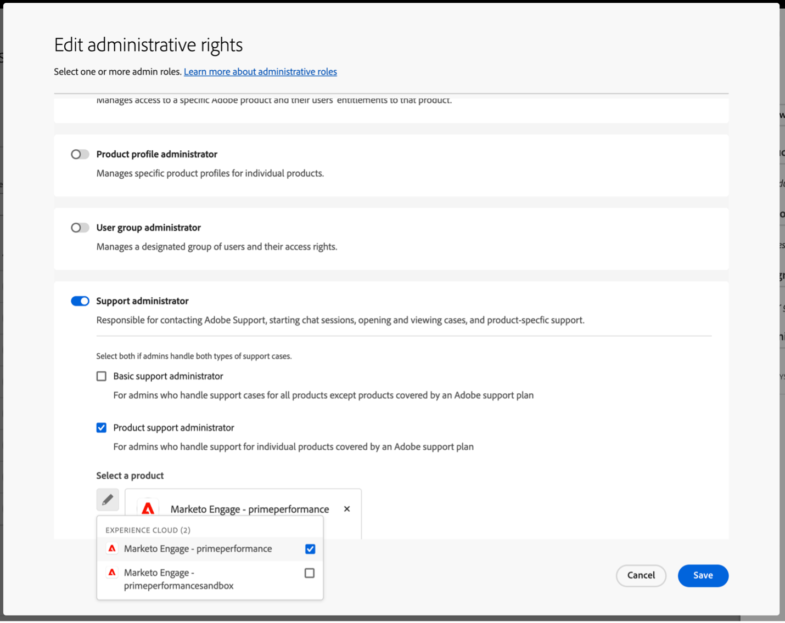
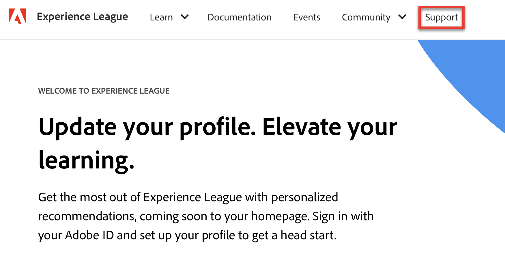
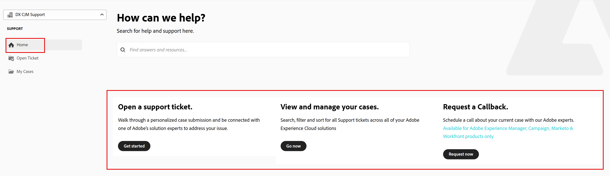
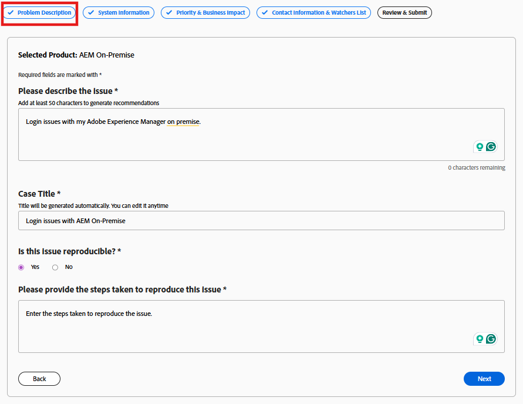
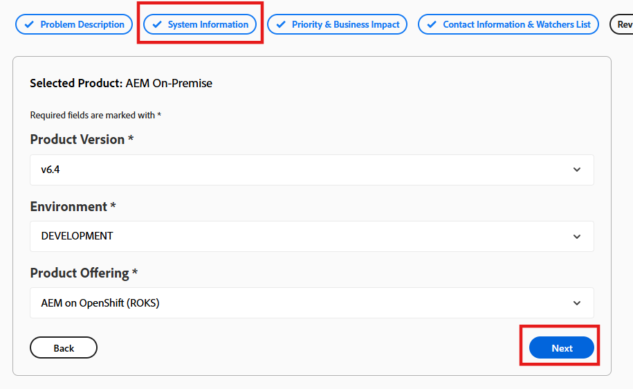

# Adobe Customer Support Experience

## Experience League Support-Tickets

Support-Tickets können jetzt über [Experience League gesendet &#x200B;](https://experienceleague.adobe.com/home#support). Anweisungen zum Senden eines Support-Tickets finden Sie im Abschnitt zu [Senden eines Support-Tickets](#create-a-support-ticket-with-experience-league).

Wir arbeiten daran, die Interaktion mit dem Adobe-Kunden-Support zu verbessern. Unser Ziel ist es, das Support-Erlebnis mithilfe von Experience League zu optimieren, indem wir zu einem einzigen Einstiegspunkt wechseln. Nach der Live-Schaltung kann Ihr Unternehmen problemlos auf den Adobe-Kunden-Support zugreifen, den Service-Verlauf über ein produktübergreifendes gemeinsames System besser einsehen und über ein einziges Portal Hilfe per Telefon, Internet und Chat anfordern.

Wenn Sie ein Adobe Commerce-Benutzer sind, lesen Sie [Senden eines Support-Falls](https://experienceleague.adobe.com/en/docs/commerce-knowledge-base/kb/help-center-guide/magento-help-center-user-guide#support-case) im Experience League Support-Benutzerhandbuch für Adobe Commerce.

## Support für berechtigte Rollen, die für die Fallübermittlung benötigt werden {#submit-ticket}

Um ein Support-Ticket in [Experience League](https://experienceleague.adobe.com/home#support) senden zu können, muss Ihnen von einem Systemadministrator die Rolle „Support-Admin“ zugewiesen worden sein. Diese Rolle kann nur einem Systemadministrator in Ihrer Organisation zugewiesen werden. Produkt-, Produktprofil- und andere Administratorrollen können die Support-Administratorrolle nicht zuweisen und können die Option **[!UICONTROL Fall erstellen]** zum Senden eines Support-Tickets nicht anzeigen. Weitere Informationen zu den verschiedenen Arten von Administratorrollen und deren Berechtigungen finden Sie unter [Administratorrollen](adobe-admin-console/admin-roles.md).

Wenn Sie Commerce verwenden, funktioniert der Prozess der Freigabe des Zugriffs für die Arbeit mit Support-Fällen anders. Weitere Informationen finden Sie unter [Freigegebener Zugriff: anderen Benutzern Berechtigungen für den Zugriff auf Ihr Konto gewähren](https://experienceleague.adobe.com/en/docs/commerce-knowledge-base/kb/help-center-guide/magento-help-center-user-guide#shared-access) im Experience League Support-Benutzerhandbuch für Adobe Commerce.

### Hinzufügen von Support-Berechtigungsrollen zu einer Organisation

Die Rolle „Support-Admin“ ist keine Administratorrolle und hat Zugriff auf Support-bezogene Informationen. Support-Administratoren können Problemberichte anzeigen, erstellen und verwalten.

So fügen Sie einen Administrator hinzu oder laden ihn ein:

1. Wählen Sie in der Admin Console **[!UICONTROL Benutzer]** > **[!UICONTROL Administratoren]** aus.
1. Klicken Sie **[!UICONTROL Admin hinzufügen]**.
1. Geben Sie einen Namen oder eine E-Mail-Adresse ein.

   Sie können nach vorhandenen Benutzern suchen oder einen neuen Benutzer hinzufügen, indem Sie eine gültige E-Mail-Adresse angeben und die Informationen auf dem Bildschirm ausfüllen.

   

1. Klicken Sie **[!UICONTROL Weiter]**. Eine Liste mit Administratorrollen wird angezeigt.

So weisen Sie einem Benutzer die Rolle Support-Administrator zu (damit ein Benutzer den Support kontaktieren kann):

1. Wählen Sie die Option **[!UICONTROL Support-Administrator]** aus.

   

1. Wählen Sie eine der beiden folgenden Optionen:

   * Option 1: **[!UICONTROL Basic Support Administrator]**. Wählen Sie diese Option aus, wenn Sie dem Support-Benutzer Zugriff auf alle Lösungen (mit Ausnahme von Marketo Engage) gewähren möchten.
   * Option 2: **[!UICONTROL Produktsupport-Administrator]**: Wählen Sie diese Option für den Marketo Engage-Support. Wählen Sie aus, welche Marketo Engage-Instanzen dem Benutzer bzw. der Benutzerin Zugriff auf den Support gewähren sollen.

   

1. Nachdem Sie die Auswahl getroffen haben, klicken Sie auf **[!UICONTROL Speichern]**.

Der Benutzer erhält eine E-Mail-Einladung zu den neuen Administratorrechten von `message@adobe.com`.

Benutzer müssen in der E **Mail auf** Erste Schritte“ klicken, um der Organisation beizutreten. Wenn neue Admins den Link **Erste Schritte** in der E-Mail-Einladung nicht verwenden, können sie sich nicht bei Admin Console anmelden.

Im Rahmen des Anmeldevorgangs werden Benutzende möglicherweise aufgefordert, ein Adobe-Profil einzurichten, wenn sie noch keines haben. Wenn Benutzende mehrere Profile mit ihrer E-Mail-Adresse verknüpft haben, müssen sie **Team beitreten** (wenn dazu aufgefordert) und dann das mit der neuen Organisation verknüpfte Profil auswählen.

Weitere Informationen finden Sie in den Anweisungen [Enterprise-Administratorrolle bearbeiten](adobe-admin-console/admin-roles.md#add-enterprise-role) in der Dokumentation zu Administratorrollen. Beachten Sie, dass nur ein Systemadministrator für Ihre Organisation diese Rolle zuweisen kann. Weitere Informationen zur Administrationshierarchie finden Sie in der Dokumentation [Administratorrollen](adobe-admin-console/admin-roles.md) .

### Erstellen eines Support-Tickets mit Experience League

>[!NOTE]
>
> Bevor Sie ein Support-Ticket senden, überprüfen Sie die Leistung, Verfügbarkeit und die bekannten Probleme des Adobe-Systems auf der Website [Adobe-Status](https://status.adobe.com/de).

Experience League ist ein Selfservice-Support-Portal, das berechtigten Kunden personalisierte Hilfe und ein benutzerfreundliches Erlebnis bietet.

1. Um ein Ticket in [Experience League](https://experienceleague.adobe.com/home#support) zu erstellen, wählen Sie die Registerkarte **[!UICONTROL Support]** in der oberen Navigationsleiste aus.

   

1. Über das **[!UICONTROL Startseite]**-Menü können Sie **[!UICONTROL Support-Ticket öffnen]**, **[!UICONTROL Ihre Fälle anzeigen und verwalten]**, **[!UICONTROL einen Callback anfordern]** oder auf zusätzliche Lernressourcen zugreifen.

   Mit **[!UICONTROL Option „Callback anfordern]** können Sie Web-Meetings mit Bildschirmfreigabe planen, was eine schnellere und effizientere Problembehebung ermöglicht. Es ist für Adobe Experience Manager, Campaign und Workfront verfügbar. Meetings können nach Wunsch des Kunden geplant werden und sofortige Einladungen werden bereitgestellt. Bei Adobe Experience Manager P1-Fällen werden sofortige Callbacks sichergestellt, um bei kritischen Problemen ein schnelles Eingreifen zu ermöglichen und Ausfallzeiten und geschäftliche Auswirkungen zu minimieren.

   

1. Um einen Fall einzureichen, wählen Sie **[!UICONTROL Support-Ticket öffnen]** aus. Sie können auch das **[!UICONTROL Ticket öffnen]** im Seitenleistenmenü auswählen.

   

### Ausfüllen des Support-Tickets

Nachdem Sie auf **[!UICONTROL Support-Ticket öffnen]** oder **[!UICONTROL Ticket öffnen]** geklickt haben, wird das Formular zur Fallerstellung angezeigt.

Das Formular verwendet einen geführten, mehrstufigen Workflow, mit dem Sie die Informationen bereitstellen können, die der Adobe-Support benötigt, um Ihr Problem effizient zu beheben. Sie können mithilfe der folgenden Abschnitte durch das Formular navigieren:

* Produktauswahl
* Problembeschreibung
* Priorität und geschäftliche Auswirkungen
* Kontaktinformationen und Watchers-Liste
* Überprüfen und senden

Sie können auch **zwischen Abschnitten wechseln** um Informationen zu aktualisieren, bevor Sie den Fall übermitteln.

Gehen Sie wie folgt vor, um ein Support-Ticket zu erstellen:

1. Klicken Sie auf den Produktnamen, um das betroffene Produkt auszuwählen, und klicken Sie dann auf **[!UICONTROL Weiter]**.

   

1. Geben Sie **[!UICONTROL Abschnitt &quot;]**&quot; eine Beschreibung des Problems ein. Der Anfragetitel wird automatisch basierend auf der Problembeschreibung generiert. Sie können den Titel bei Bedarf bearbeiten. Überprüfen Sie, ob das Problem reproduziert werden kann. Wählen Sie **Ja**, wenn das Problem reproduzierbar ist. Es wird ein Textfeld angezeigt, in dem Sie die Schritte beschreiben können, die zur Reproduktion des Problems erforderlich sind. Wählen Sie **Nein**, wenn das Problem nicht konsistent reproduziert werden kann.

   

   Beinhalten Details wie:

   * Was Sie zu tun versuchen
   * Was nicht erwartungsgemäß funktioniert
   * Schritte, die Sie bereits unternommen haben
   * Ob das Problem reproduzierbar ist

   Während Sie die Problembeschreibung eingeben, zeigt Experience League KI-gestützte Empfehlungen in einem Bedienfeld neben dem Formular an. Diese Empfehlungen:

   * Relevante Dokumentation oder bekannte Lösungen vorschlagen
   * Hilft bei der Bestätigung, ob das Problem bereits behoben wurde
   * Reduzieren der Notwendigkeit, einen Fall für häufige Probleme einzureichen

   Das Bedienfeld wird angezeigt, ohne den Prozess zur Fallerstellung zu unterbrechen. Sie können die Empfehlungen jederzeit überprüfen und den Fall bei Bedarf weiter einreichen.

   >[!NOTE]
   >
   >Um Empfehlungen zu generieren, **die (Problembeschreibung muss mindestens 50 Zeichen enthalten**. Ein Echtzeit-Zeichenzähler hilft Ihnen, die Mindestanforderung zu verfolgen.

   

1. Klicken Sie **[!UICONTROL Weiter]**.

   

1. Geben Sie im Abschnitt **[!UICONTROL Systeminformationen]** die **[!UICONTROL Produktversion]**, **[!UICONTROL Umgebung]**, **[!UICONTROL Produktangebot]** an und geben Sie an, ob kürzlich Änderungen an der Umgebung oder Instanz vorgenommen wurden. Wählen Sie **Ja**, um weitere Details zu den Änderungen anzugeben. Wählen Sie **Nein** wenn keine Änderungen vorgenommen wurden, und klicken Sie auf **[!UICONTROL Weiter]**.

   >[!NOTE]
   >
   > Je nach ausgewähltem Produkt können zusätzliche Felder angezeigt werden. Diese Felder enthalten Details zur Umgebung, in der das Problem auftritt.

   

1. Wählen Sie **[!UICONTROL Abschnitt „Priorität und geschäftliche]**&quot; Folgendes aus:
   * Vorrangiger Fall (P4 - Gering, P3 - Wichtig, P2 - Dringend, P1 - Kritisch)
   * Geben Sie die Details der Geschäftsauswirkungen an, wenn die ausgewählte Priorität P1 - Kritisch ist, und klicken Sie dann auf **[!UICONTROL Weiter]**.

   

   Weitere Informationen dazu, wie sich die Priorität von Fällen und die geschäftlichen Auswirkungen auf die Support-Antwortzeiten auswirken, finden Sie [Gezielte anfängliche Antwortzeiten für den Support](https://experienceleague.adobe.com/en/docs/support-resources/data-sheets/overview#targeted-initial-response-times-for-support) in der Dokumentation zu den Ressourcen für Erfolgspläne.

1. Wählen Sie **[!UICONTROL Abschnitt „Kontaktinformationen und]**&quot; die Zeitzone aus, geben Sie Ihre Telefonnummer ein, fügen Sie Beobachter hinzu, fügen Sie bei Bedarf Dateien hinzu und klicken Sie dann auf **[!UICONTROL Weiter]**.

   

1. Überprüfen Sie im Abschnitt **[!UICONTROL Überprüfen und Senden]** Ihre Falldetails und klicken Sie auf **[!UICONTROL Fall genehmigen und senden]**.

   

   Der Schritt **[!UICONTROL Überprüfen und Senden]** fasst alle eingegebenen Informationen zusammen und ermöglicht Ihnen Folgendes:

   * Alle Falldetails an einem Ort überprüfen
   * Zurück zu einem vorherigen Schritt navigieren, um Änderungen vorzunehmen
   * Zurück zur Prüfungszusammenfassung ohne den Fortschritt zu verlieren

Nach der Übermittlung:

* Der Fall wird in Experience League protokolliert
* Sie können Updates verfolgen und über das Portal mit dem Support kommunizieren
* Der Adobe-Support antwortet basierend auf der von Ihnen angegebenen Priorität und Wirkung

>[!TIP]
>
> Wird die Option **[!UICONTROL Ticket öffnen]** oder die Registerkarte **[!UICONTROL Support]** nicht angezeigt, wenden Sie sich an Ihren Systemadministrator, um die Rolle „Support-Admin“ zuzuweisen.

>[!NOTE]
>
> Wenn das Problem zu Ausfällen oder schwerwiegenden Unterbrechungen des Produktionssystems führt, wird eine Telefonnummer bereitgestellt, um sofortige Hilfe zu leisten.