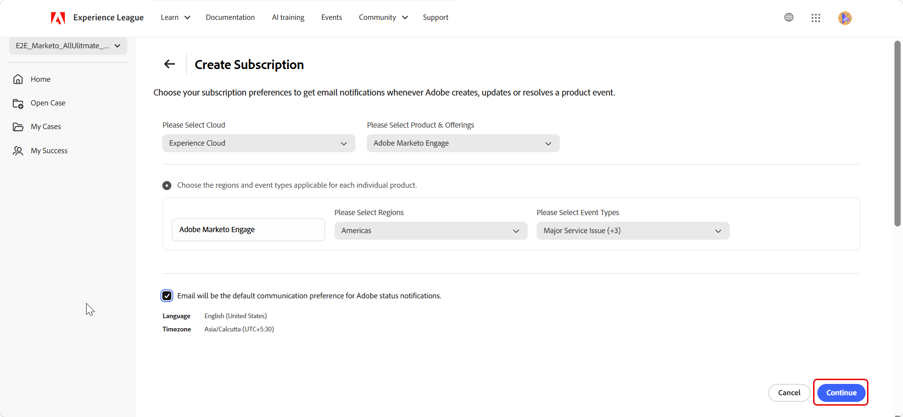

# Experience League Support-Portal - Neue Benutzeroberfläche

## Überblick

Das neu gestaltete Experience League Support-Portal bietet ein einheitliches und intuitives Erlebnis für die Verwaltung von Adobe Support-Aktivitäten. Sie bietet schnelleren Zugriff auf wichtige Funktionen, einschließlich der Verfolgung von Support-Fällen, der Überwachung des Produktstatus, des Zugriffs auf Fallerkenntnisse und der Verbindung mit dem Success-Team.

>[!NOTE]
>
>Informationen zum Erstellen und Verwalten von Support-Fällen im neu gestalteten Portal finden Sie unter [Erstellen und Verwalten von Support-Fällen](exl-new-ui-support-cases.md).

## Startseite

Die **[!UICONTROL Startseite]** dient als zentraler Knotenpunkt für Support-Aktivitäten. Es bietet einen Überblick über die Support-Umgebung und schnellen Zugriff auf wichtige Funktionen.

Das linke Navigationsfenster bietet Zugriff auf die folgenden Abschnitte:

- **[!UICONTROL Startseite]** wird als standardmäßige Landingpage geöffnet und zeigt eine zentrale Ansicht der Support-Aktivität an.
- **[!UICONTROL Fall öffnen]** öffnet den Workflow zur Erstellung von Fällen im neu gestalteten Portal. Siehe [Erstellen und Verwalten von Support-Fällen](exl-new-ui-support-cases.md).
- **[!UICONTROL Meine Fälle]** öffnet die Liste der Fälle im neu gestalteten Portal. Siehe [Erstellen und Verwalten von Support-Fällen](exl-new-ui-support-cases.md).
- **[!UICONTROL My Success]** ist nur für Ultimate Success plan-Kunden verfügbar.

## Wechselnde Organisationen

Wenn Sie mit mehreren Organisationen verknüpft sind, verwenden Sie **Organisationswechsel** in der linken oberen Ecke des Portals.

Beim Wechsel der Organisation werden Falldaten, Produktstatus und Support-Informationen im gesamten Portal aktualisiert, um die ausgewählte Organisation widerzuspiegeln.

## Wechseln zwischen Portalen

Verwenden Sie den Umschalter im -Portal, um zwischen dem neu gestalteten Experience League-Supportportal und dem aktuellen Portal zu wechseln.

Beide Portale bleiben synchronisiert, sodass Falldaten und Support-Informationen erlebnisübergreifend konsistent bleiben.

Die Startseite enthält ein personalisiertes Willkommensbanner mit einer globalen Suchleiste, mit der Sie das Experience League Support-Portal durchsuchen können.

Die folgenden Schnellaktionen sind oben auf der Seite &quot;**[!UICONTROL &quot;]**:

1. **[!UICONTROL Support-Fall öffnen]** - Öffnet den Workflow zur Erstellung von Fällen im neu gestalteten Portal. Wählen Sie **[!UICONTROL Erste Schritte]** aus.

1. **[!UICONTROL Fälle anzeigen und verwalten]** - Öffnet die Seite **[!UICONTROL Meine Fälle]** im neu gestalteten Portal. Wählen Sie **[!UICONTROL Jetzt starten]** aus.

1. **[!UICONTROL Callback anfordern]** - Planen Sie einen Anruf zu diesem Fall mit einem Adobe-Experten. Fordern Sie in P1-Fällen (kritisch) einen sofortigen Callback an. Planen Sie für P2- und P3-Fälle ein Web-Meeting mit einem Support-Techniker zu einem passenden Zeitpunkt. Wählen Sie **[!UICONTROL Jetzt anfordern]** um zu beginnen.

## Analytics-Service

Im **[!UICONTROL Service Analytics]** wird eine Zusammenfassung der Aktivität von Support-Fällen angezeigt. Verwenden Sie den Ansichtsselektor, um zwischen &quot;**[!UICONTROL Anfragen“]** &quot;**[!UICONTROL Organisation“]**:

- **[!UICONTROL Meine Fälle]** - Zeigt Fallstatistiken speziell für den Kontakt an.
- **[!UICONTROL Meine Organisationsfälle]** - Zeigt Fallstatistiken für die ausgewählte Organisation an.

Die ausgewählte Ansicht gilt für alle Metriken und Diagramme in diesem Abschnitt, einschließlich der Abschnitte [[!UICONTROL Anzahl der Fälle nach Priorität]](#cases-count-by-priority) und [[!UICONTROL Meine gesendeten ]](#my-submitted-cases)&quot;.

Der **[!UICONTROL Service Analytics]** Abschnitt enthält die folgenden Metriken:

- **[!UICONTROL Ausstehende Antwortfälle]** - Zeigt die Anzahl der Fälle an, die auf eine Antwort warten.
- **[!UICONTROL Gesendete Fälle]** - Zeigt die Gesamtzahl der gesendeten Fälle an.

## Fälle nach Priorität zählen

In diesem Abschnitt wird eine visuelle Aufschlüsselung der Support-Fälle nach Prioritätsstufe angezeigt.

Die Auswahl **[!UICONTROL Meine Fälle]** und **[!UICONTROL Meine Organisation]** im Abschnitt **[!UICONTROL Service Analytics]** gilt für dieses Diagramm und ermöglicht die Anzeige auf Einzel- oder Organisationsebene.

Bewegen Sie den Mauszeiger über ein Prioritätssegment, um eine QuickInfo anzuzeigen, die Folgendes enthält:

- Gesamtzahl der Fälle für diese Prioritätsstufe
- Anzahl offener Fälle
- Anzahl abgeschlossener Fälle

## Meine eingereichten Anfragen

In diesem Abschnitt werden die drei zuletzt eingereichten Support-Fälle angezeigt, darunter:

- Fall-ID
- Anwaltsbezeichnung
- Priorität
- Unterbreitungsdatum
- Status

Wenn **[!UICONTROL Meine Fälle]** in **[!UICONTROL Service Analytics]** ausgewählt ist, werden in diesem Abschnitt die drei zuletzt gesendeten Fälle angezeigt. Wenn **[!UICONTROL Meine Organisation Anfragen]** im Abschnitt **[!UICONTROL Service Analytics]** ausgewählt ist, werden die drei zuletzt gesendeten Anfragen im gesamten Unternehmen angezeigt.

Wählen Sie eine **[!UICONTROL Fall-ID]** aus, um die Falldetails im neu gestalteten Experience League-Support-Portal anzuzeigen.

Wählen Sie **[!UICONTROL Alle Anfragen anzeigen]** aus, um die Seite **[!UICONTROL Meine Anfragen]** im neu gestalteten Experience League-Support-Portal zu öffnen.

Wenn **[!UICONTROL Meine Fälle]** in **[!UICONTROL Service Analytics]** ausgewählt ist, wird **[!UICONTROL Meine Fälle (Alle)]** vorausgewählt und im Experience League Support-Portal geöffnet. Wenn **[!UICONTROL Meine Organisationsfälle]** ausgewählt ist, wird **[!UICONTROL Die Fälle (alle)]** meiner Organisation im Experience League-Support-Portal vorausgewählt.

## Warnhinweise zum Produktstatus

In diesem Abschnitt wird der aktuelle Betriebsstatus der dem Unternehmen zugewiesenen Adobe-Produkte angezeigt.

Der Status **[!UICONTROL Verfügbar]** bedeutet, dass das Produkt voll funktionsfähig ist und keine aktiven Ausfälle auftreten. Wenn ein oder mehrere Probleme vorhanden sind, wird die Gesamtzahl der aktiven Probleme auf der Produktkarte angezeigt.

Produkte werden in der folgenden Reihenfolge angezeigt:

1. Produkte mit aktiven Problemen
1. Verbleibende Produkte in alphabetischer Reihenfolge

Diese Priorisierung hilft dabei, Produkte, die Aufmerksamkeit erfordern, schnell zu identifizieren und zu priorisieren. Sie können eine oder mehrere Produktkarten auswählen, um Warnhinweise in **[!UICONTROL Ihre Systemstatus-Warnhinweise]** auf der **[!UICONTROL -]** zu filtern.

## Ihr Systemstatus-Warnhinweise

In diesem Abschnitt werden Echtzeit-Warnhinweise für Adobe-Produkte angezeigt. Sie können Warnhinweise mithilfe der folgenden Registerkarten nach Ereignistyp filtern:

- Wesentlich
- Geringfügig
- potenziell
- Wartung
- Ankündigungen

Und jeder Warnhinweis enthält:

- Anfragenummer
- Cloud
- Region
- Status
- Start- und Endzeit für Ihre Referenz

Wählen Sie einen Warnhinweis aus, um ihn zu erweitern und zusätzliche Details anzuzeigen.

### Abonnements verwalten

Verwenden Sie **[UICONTROL Abonnements verwalten]** um E-Mail-Benachrichtigungen für Adobe-Produkt- und Service-Statusereignisse zu konfigurieren. Mit Abonnements bleiben Sie auf dem Laufenden, wenn Adobe Ereignisse für ausgewählte Produkte und Regionen erstellt, aktualisiert oder auflöst.

1. Wählen **[!UICONTROL im Abschnitt „Warnhinweise]** Systemstatus“ die Option **[!UICONTROL Abonnements verwalten]** aus.

   

1. Wählen Sie auf der **[!UICONTROL Abonnements verwalten]** die Option **[!UICONTROL Abonnement erstellen]** aus.

   

1. Wählen **[!UICONTROL unter Please select Cloud]** die Adobe-Cloud aus, die das Produkt enthält, das Sie überwachen möchten.
1. Wählen **[!UICONTROL unter „Produkt und Angebote auswählen]** das Produkt aus, für das Sie Benachrichtigungen erhalten möchten.
1. Wählen **[!UICONTROL unter „Regionen auswählen]** eine oder mehrere zu überwachende Regionen aus.
1. Wählen **[!UICONTROL unter „Ereignistypen auswählen]** einen oder mehrere der folgenden Ereignistypen aus:

   * Hauptdienstproblem
   * Geringfügiger Service-Fehler
   * Wartungsdienst
   * Ankündigungen

   

1. Überprüfen Sie die standardmäßigen Benachrichtigungseinstellungen, einschließlich Sprache und Zeitzone.
1. Wählen Sie **[!UICONTROL Weiter]** aus.
1. Überprüfen Sie die Abonnementdetails, einschließlich der ausgewählten Cloud, Produkte, Services, Regionen und Ereignistypen.
1. Wählen **[!UICONTROL Bestätigen]**, um das Abonnement zu erstellen.

   

1. Eine Bestätigungsmeldung wird angezeigt und das Abonnement wird erstellt.

Nachdem das Abonnement erstellt wurde, sendet Adobe E-Mail-Benachrichtigungen, wenn Ereignisse, die den Kriterien für das ausgewählte Produkt, die ausgewählte Region und den ausgewählten Ereignistyp entsprechen, erstellt, aktualisiert oder aufgelöst werden.

>[!NOTE]
>
>E-Mail ist der standardmäßige Kommunikationskanal für Statusbenachrichtigungen. Abonnementvoreinstellungen gelten nur für das ausgewählte Produkt, die ausgewählten Regionen und die ausgewählten Ereignistypen.

Beim nächsten Öffnen von **[!UICONTROL Abonnements verwalten]** zeigt die Seite Ihre aktuellen Abonnementdetails an, einschließlich der ausgewählten Cloud-, Produkt-, Service-, Regionen- und Ereignistypen.

Auf dieser Seite können Sie die folgenden Aktionen ausführen:

* Wählen **[!UICONTROL Abonnement bearbeiten]**, um ein vorhandenes Abonnement zu ändern.
* Wählen Sie **[!UICONTROL Alle abmelden]** aus, um alle Abonnements zu entfernen.
* Wählen Sie das Löschsymbol neben einem Abonnement aus, um ein einzelnes Abonnement zu entfernen.

## Ihre Plandaten

In diesem Abschnitt werden wichtige Details zum Support-Plan (Ultimate Success plan und Expert Success plan) und zu den verfügbaren Vorteilen angezeigt. Wählen Sie **[!UICONTROL Weitere Informationen]** aus, um das gesamte Angebot an Planungsangeboten zu erkunden.

## Mein Erfolg

Die Seite **[!UICONTROL Mein Erfolg]** bietet eine personalisierte Ansicht der Interaktion mit Adobe. Es bietet direkten Zugriff auf das Success-Team, Programmvorteile und Lernressourcen.

>[!NOTE]
>  
>Diese Seite steht nur Kunden mit dem Plan **[!UICONTROL Ultimate Success]** zur Verfügung.

Die Seite enthält:

- Eine willkommene Nachricht, die erläutert, wie Ultimate Success durch strategische Führung und proaktive technische Unterstützung im Gesundheitswesen leistungsstarke digitale Erlebnisse bereitstellt
- Eine Option **[!UICONTROL Video ansehen]**, um mehr über den Plan zu erfahren
- Wichtigste Bestandteile des Plans, darunter:
  - **[!UICONTROL Erfolgsteam]**
  - **[!UICONTROL Erfolgsbeschleuniger]**
  - **[!UICONTROL Mutual Action Plan]**

Es bietet außerdem Zugriff auf Lernressourcen wie Experience League, die Experience League-Community und Premium-Lernabonnements.

### Adobe Success-Team

In diesem Abschnitt wird Ihr dediziertes Adobe Success-Team angezeigt. Wählen **[!UICONTROL Kontakt]** neben einem Teammitglied aus, um eine E-Mail zu senden.

