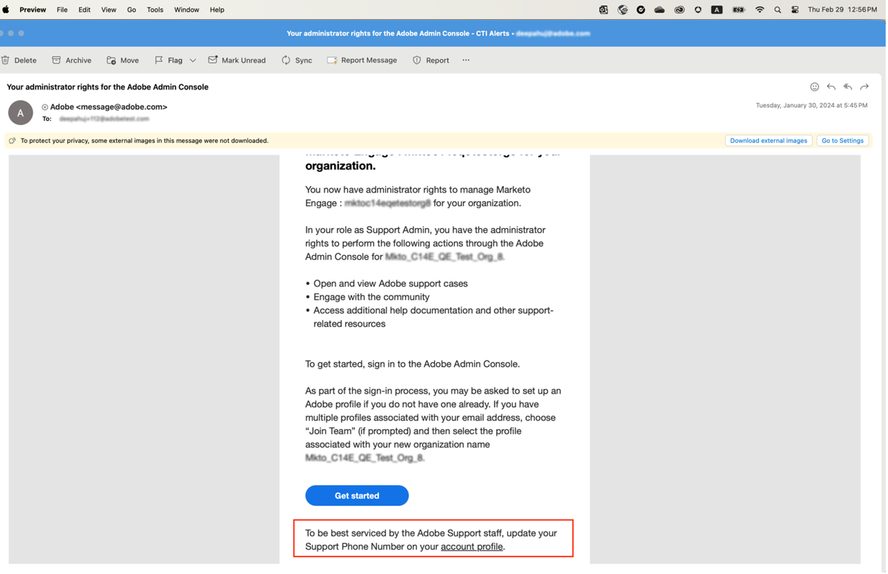
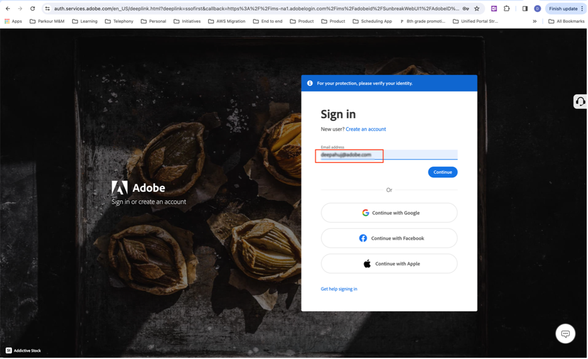
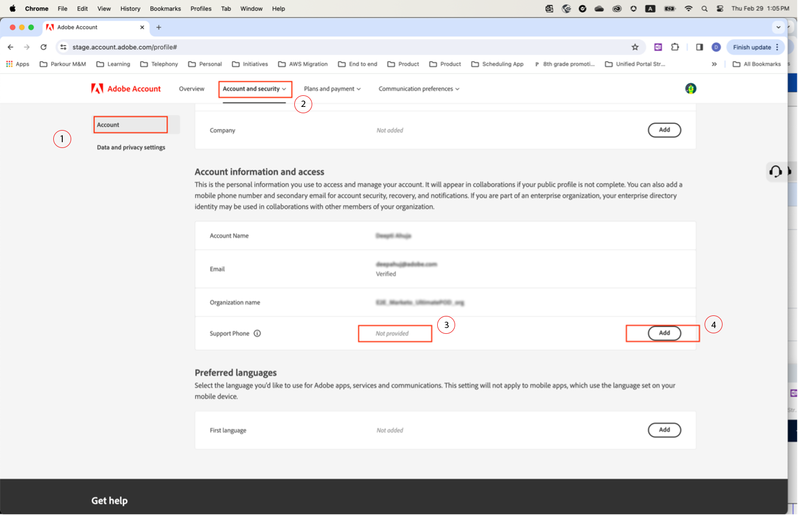
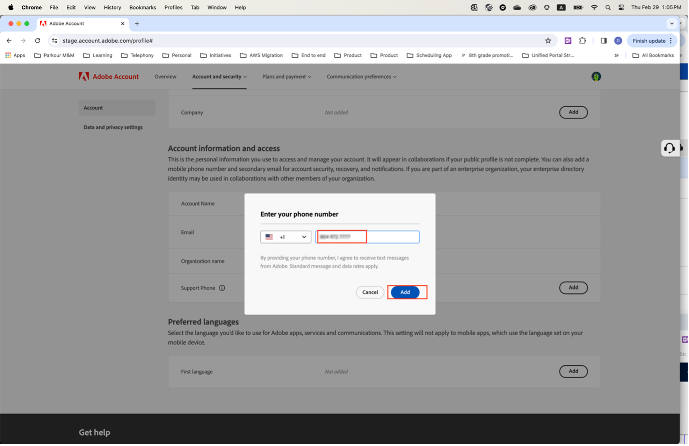
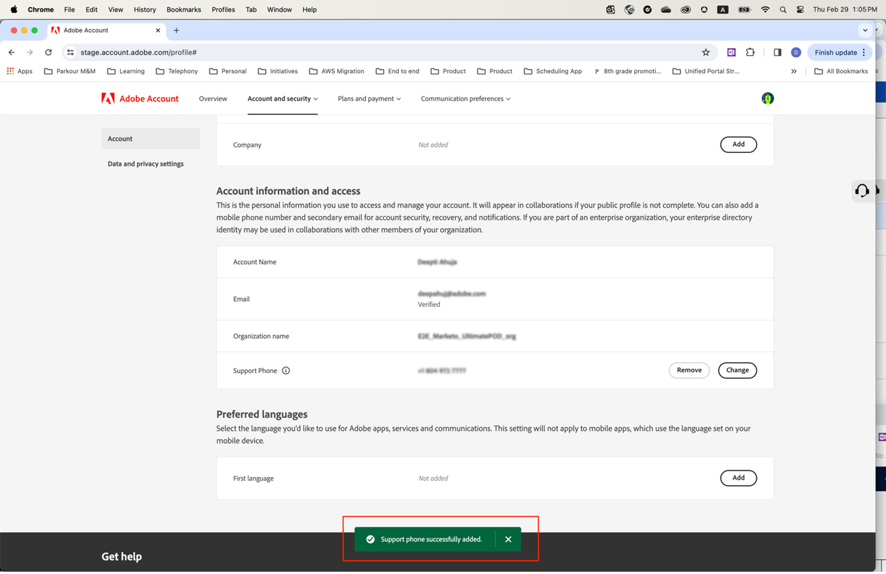

# Geben Sie eine bevorzugte Support-Telefonnummer an

Wenn Ihnen die Rolle **Admin** zugewiesen wurde, z. B **„Produktsupport-**&quot;, erhalten Sie eine E-Mail, in der bestätigt wird, dass Sie über Administratorberechtigungen zum Verwalten der Instanz verfügen.

Die E-Mail enthält jetzt den unten stehenden Text in rot, in dem erklärt wird, wie Sie zu Ihrem **[!UICONTROL Kontoprofil]** gehen und uns Ihre bevorzugte Support-Telefonnummer mitteilen können.

So geben Sie Ihre bevorzugte Telefonnummer an:

1. Klicken Sie auf den **[!UICONTROL Kontoprofil]**-Link, um ein neues Fenster zu öffnen und sich mit `account.adobe.com` anzumelden.

   

1. Navigieren Sie durch den Anmeldevorgang und landen Sie auf dem folgenden Bildschirm auf `account.adobe.com`.
1. Wählen Sie **[!UICONTROL Konto und Sicherheit]** > **[!UICONTROL Konto]** aus, um das Feld „Support-Telefonnummer“ anzuzeigen.
1. Fügen Sie hier eine Telefonnummer hinzu, die wir verwenden sollen, um Sie für Ihren Support-Bedarf zu erkennen.

