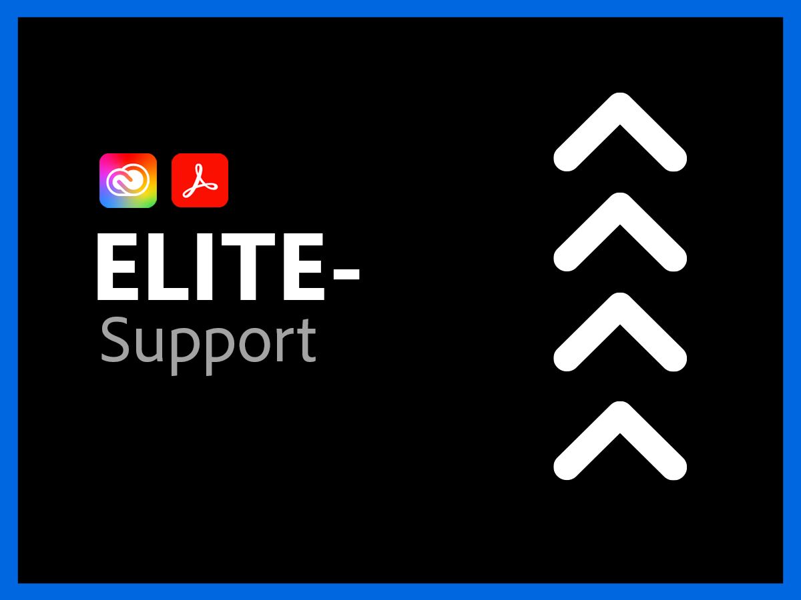

# Support-Services für Creative Cloud Enterprise und Document Cloud

Die Kundenunterstützung von Adobe Creative Cloud und Document Cloud setzt sich für Ihren Erfolg ein. Alle Abonnements beinhalten einen Support-Level, mit dem Sie einfachen Zugriff auf technische Unterstützung durch unsere hoch qualifizierten technischen Mitarbeiter haben.

Für umfangreichere Anforderungen bieten wir Adobe-Support-Pläne an, die den Zugang zu benannten Support-Fachleuten sowie Sitzungen für proaktive Betreuung und Service-Überprüfungen umfassen. Egal, wie komplex Ihr Support-Bedarf auch sein mag, Adobe bietet das technische und betriebliche Know-how, mit dem Sie Ihre Adobe-Programme bestmöglich einsetzen und optimale Ergebnisse erzielen können.

<table style="table-layout:fixed">
<tr>
  <td>
    
    

    <a href="dme-standard.md"><strong>Standard-Support</strong></a>  (<a href="assets/DMeStandardSupportDatasheet_2022.pdf" target="_blank">PDF</a> anzeigen)
    

    
Zugang rund um die Uhr für autorisierte Benutzer (Administratoren) zu unseren technischen Supportteams per Chat oder Telefon sowie die Möglichkeit, Hilfeanfragen über unser Support-Web-Portal zu stellen. 

     
  </td>
  <td>
    
    

    <a href="dme-business.md"><strong>Business-Support</strong></a> (<a href="assets/DMeBusinessSupportDatasheet_2022.pdf" target="_blank">PDF</a> anzeigen)
    

    
Vorrangiges Routing für Support-Fälle, um eine schnellere Verbindung zu höherwertigem Support sicherzustellen, und die Möglichkeit, einen Lead für Kunden-Support zu nutzen, um regelmäßige Mitteilungen und Aktualisierungen für Ihre wichtigsten Support-Anfragen zu erhalten.

     
  </td>
</tr>
<tr>
  <td>
    
    

    <a href="dme-enterprise.md"><strong>Enterprise-Support</strong></a> (<a href="assets/DMeEnterpriseSupportDatasheet_2022.pdf" target="_blank">PDF</a> anzeigen)
    

    
Der technische Ansprechpartner im Supportteam von Adobe, der über fundierte Erfahrungen in Ihrer Lösung verfügt, arbeitet mit Ihnen und Ihren Technikern zusammen, um für eine zeitnahe Lösung aller Support-Anfragen zu sorgen.

     
  </td>
  <td>
    
    

    <a href="dme-elite.md"><strong>Elite-Support</strong></a> (<a href="assets/DMeEliteSupportDatasheet_2022.pdf" target="_blank">PDF</a> anzeigen)
    

    
Ein technischer Ansprechpartner im Supportteam von Adobe und ein technischer Kundenbetreuer, der mit Ihnen zusammenarbeitet, bieten Ihnen erstklassige proaktive Unterstützung, um sicherzustellen, dass Sie Ihre Investition optimal nutzen und Probleme vermeiden können.

     
  </td>
</tr>
</table>

