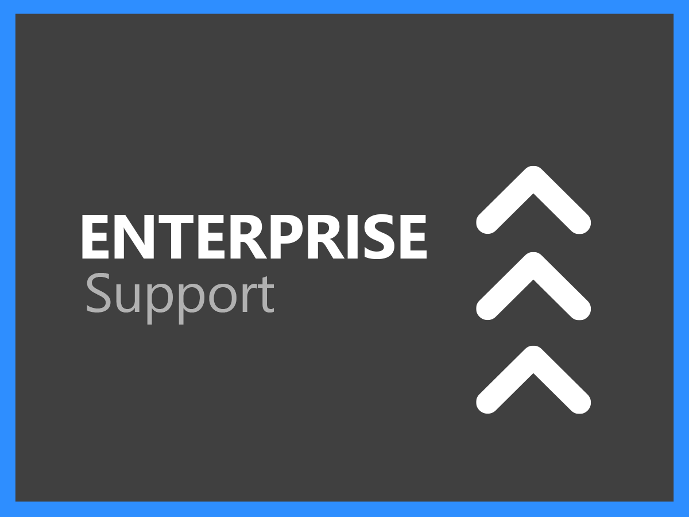

# Support-Services – Übersicht

Der Support für Adobe Experience Cloud tut alles, um Sie auf Ihrem Weg zum Erfolg zu unterstützen. Alle Abonnements beinhalten einen Support-Level, mit dem Sie einfachen Zugriff auf technische Unterstützung durch unsere hoch qualifizierten technischen Ressourcen haben.

Für umfassendere Bedürfnisse bieten wir Adobe Support-Services an, die Zugriff auf spezifische Support-Mitarbeiter, beschleunigte Service-Level-Reaktionsziele und Sessions für proaktives Mentoring und Service-Prüfung umfassen. Egal, wie komplex Ihr Support-Bedarf auch sein mag, Adobe bietet das technische und betriebliche Know-how, mit dem Sie Ihre Adobe-Lösung bestmöglich einsetzen und optimale Eregebnisse erzielen können.

<table style="table-layout:fixed">
<tr>
  <td>
    
    

    <a href="online.md"><strong>Online Support</strong></a> (<a href="assets/OnlineSupportDatasheet.pdf" target="_blank">PDF</a> anzeigen)
    

    
Eingeschränkter Zugriff auf telefonischen Support

     
  </td>
  <td>
    
    

    <a href="business.md"><strong>Business Support</strong></a> (<a href="assets/BusinessSupportDatasheet.pdf" target="_blank">PDF</a> anzeigen)
    

    
Vollständiger Zugriff auf die technischen Support-Teams von Adobe und auf einen Account Support Lead für das Account-Management.

     
  </td>
</tr>
<tr>
  <td>
    
    

    <a href="enterprise.md"><strong>Enterprise Support</strong></a> (<a href="assets/EnterpriseSupportDatasheet.pdf" target="_blank">PDF</a> anzeigen)
    

    
Erweiterte Support-Service-Level-Targets (SLTs), die Vorteile von technischem Know-how sowie eine Kontaktperson in Form eines spezifischen Support-Mitarbeiters.

     
  </td>
  <td>
    
    

    <a href="elite.md"><strong>Elite Support</strong></a> (<a href="assets/EliteSupportDatasheet.pdf" target="_blank">PDF</a> anzeigen)
    

    
Erstklassige Service Level Targets (SLTs), proaktive Unterstützung und Partnerschaft mit einem Technical Account Manager und einem spezifischen Support-Mitarbeiter.

     
  </td>
</tr>
</table>

