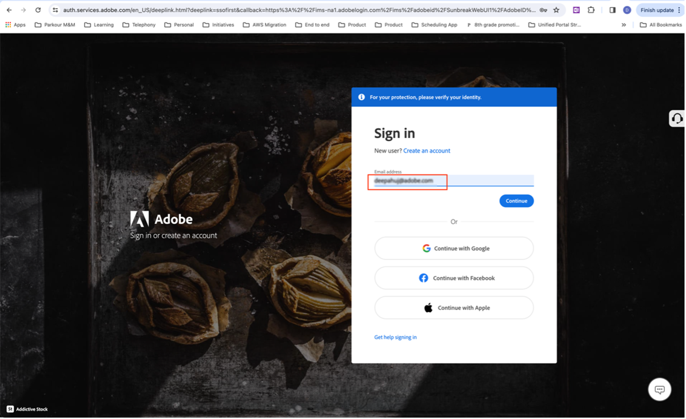

# Bevorzugte Support-Telefonnummer angeben

Wenn Ihnen die Rolle &quot;Admin&quot;zugewiesen wird, z. B. ein &quot;Produktsupport-Administrator&quot;, erhalten Sie eine E-Mail, in der Sie darüber informiert werden, dass Sie über &quot;Administrator&quot;-Rechte für die Verwaltung der Instanz verfügen, für die Ihnen Administratorrechte erteilt wurden.

Die E-Mail enthält jetzt den Text unten in rot, der erklärt, wie Sie zu Ihrem Kontoprofil gehen und Ihre bevorzugte Support-Telefonnummer mit uns teilen können.

So geben Sie Ihre bevorzugte Telefonnummer an:

1. Klicken Sie auf **Kontoprofil** Link zum Öffnen eines neuen Fensters zur Anmeldung mit `account.adobe.com`.

   

1. Gehen Sie durch den Anmeldevorgang und gehen Sie auf den Bildschirm unten auf `account.adobe.com`.
1. Klicken Sie dann auf die folgenden Registerkarten Konto und Sicherheit > Konto , um das Feld Support-Telefonnummer anzuzeigen.
1. Fügen Sie hier eine Telefonnummer hinzu, mit der Sie von uns für Ihre Supportanfragen erkannt werden sollen.

